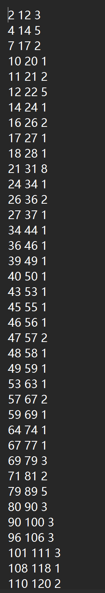

# 文档

## 说明部分

程序采用两步法，先利用归并排序实现一个简单的外排序，然后利用滑动窗口实现数对的筛选。

具体来说，一共设计了两个类，第一个是外排序类，定义在externalSort.h中并在externalSort.cpp中实现，构造函数中传入文件的路径字符串可以实现自动的排序，无其他接口。

另一个类是筛选类，定义在generate.h中并在同名文件.cpp中实现，构造函数无作用，需要通过fit接口接入已排序的数据，并用generate接口进行生成数对

## 测试部分

通过一个随机数生成程序生成了10^6个大小在1~10^6之间的数字，在命令行中调用编译好的程序，命令行参数为外排序归并的分桶大小。输入1^5即可，将输出一个文件。以下是这个文件的部分截图。经检验测试通过。

对于超内存的数据，理论上是可以处理的，只要数据不要超过窗口的大小即可处理。但由于生成处理大量数据对于计算机性能要求过高，暂时没有测试，以上的10^6次数据可以在普通pc计算机上消耗20s左右完成响应，对于分布极端集中的数据需要更多的时间处理。