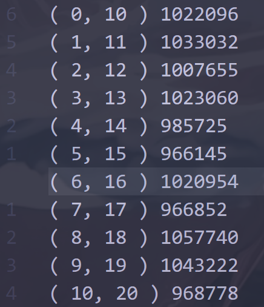

# 说明文档

> 由于在上个实验中，已经采用了 **排序** 为基础的数对匹配策略，因此本次的大作业关注文档的完善以及以下几个优化：
>
> - 如何处理密集分布的超过内存限制的超大数据集
> - 如何借助更现代的工具完成这个任务


## 回顾与摘要

再上一个实验中，我们设计了一个基于外部排序以及滑动窗口实现的大规模数据处理，但是在进一步的分析中，我们发现了一些问题：

1. 算法在面对数据分布比较集中的情况下（如在 1 - 100 间的 1,000,000,000 个随机数），窗口的大小可能超出我们的想象，以至于面对密集型数据时容易产生内存不够用的情况。
2. 算法的复杂度较高，由于首先要进行一轮排序，后续再读取的过程中既要读入队一遍又要弹出队列一遍，消耗了大量的时间成本，这在面对复杂工程的情况下有巨大的优化空间。

基于此，我们接下来将提出一种更有效的处理应对密集型数据的方法，并且极大的优化了算法复杂度。同时，提出了一种面对密集与非密集型数据的通用思路。

另外，在本文的最后，我们会利用 Spark 提供的 Python 接口，给出一种更现代的解决方案。

本项目的所有源代码和说明文档均可在 [YichenShen0103/BigDataSystem (github.com)](https://github.com/YichenShen0103/BigDataSystem) 中找到。


## 算法设计与接口实现

在新的方法中，我们使用生成哈希表的键值对（数字 + 词频）代替排序这一过程。

我们设计了以下类来实现这个过程：

```c++
class Count {
private:
    string cache_path; // storing cache file
    size_t chunk_size;
    void count_frequencies_in_chunk(const string &file_path); // same as function name 
    void cleanup_temp_files(); // clean caches in cache_path
    map<int, int> merge_temp_files(); // same as function name
    void write_results_to_file(map<int, int> &final_frequency, string &output_file_path); // same as name

public:
    Count(string cache_path, size_t chunk_size); // init object
    void fit(string file_path, string output_file_path); // a interface for main.cpp
};
```


其中最重要的 **fit** 函数，我们展开介绍这个接口的具体实现：

首先我们需要根据输入的数据文件统计词频，这里我们采用一种借助 cache file 来简化处理的方式。最后将这些 cache 合并为一个大的 map<int, int> 数据结构。

然后我们采用一个滑动窗口来按顺序读取，并且这个窗口最大只有 10 个元素因此不会像先前的方法一样面临内存不够的问题。

```c++
void Count::fit(string file_path, string output_file_path) {
    count_frequencies_in_chunk(file_path);
    auto final_frequency = merge_temp_files();
    cleanup_temp_files();
    // write_results_to_file(final_frequency, output_file_path);

    deque<int> window;
    ofstream output(output_file_path);
    for (const auto &pair : final_frequency) {
        window.push_back(pair.first);
        while (!window.empty() && window.back() - window.front() > 10)
            window.pop_front();
        if (window.back() - window.front() == 10)
            output << "( " << window.front() << ", " << window.back() << " ) "
                   << final_frequency[window.front()] * final_frequency[window.back()] << "\n";
    }
    output.close();
}
```


此处需要指出的是，由于我们专门针对密集型数据做了这个优化，所以实际上我们假设数值的差别没有那么多（比如说这个数据集不是 1,000,000,000 个不同的数字）。如果我们想设计一个比较通用的算法，那么我们需要一个分布式存储的哈希表。落实到具体设计上可以取消 merge_temp_files 这个接口，直接把 cache 作为一个哈希表即可。


## 实验与测试

由于数据体量巨大，我们无法上传测试数据，为了保证实验结果可复现我们提供了完整的多平台自动化测试工具。

项目根目录下有以下结构：

```
/- scripts
	|- generate_data.cpp
	|- generate_data(.exe)
/- bin
	|- BigDataSystem(.exe)
```

在根目录下依次运行以下命令（假设你的测试环境是Windows，Linux的一种）

```bash
./scripts/generate_data(.exe) 1000000000
mkdir build && cd build
cmake ..
cmake --build .
../bin/BigDataSystem(.exe) 10000000
```


其中 generate_data 这个脚本是用来产生 “你的命令行参数” 个位于 0~10^6 的数据。后续是执行 cmake 的编译过程并且运行主程序。

如果运行正常，您将在 ${BigDataSystem_root_path}/data 中看到至少两个文件，data.txt 和 output_pairs.txt，其中前者是生成的数据源文件，另一个是最终生成的数据对以及出现次数。


下面是在 Windows 系统下运行以上命令在 10^9 大小的数据集进行测试的结果 output_pairs.txt 的前若干行，总计运行时间在 10 min 内。




## 拓展

实际上在工业运用中，C++ 并不是进行大数据处理最好的工具语言，这是由于一些现代化工具并没有为 C++ 做完善的接口。相对而言使用 Java（如果对性能要求较高并且会与其他系统做结合） 和 Python（如果数据量不大）是相对更好的。

下面是一个使用 pyspark 库编写的实际案例，如果您想要在自己运行这个脚本，请保证您有以下的环境有以下依赖：

- 版本相适应的 Java(>=8)、Hadoop、Spark
- 至少包含 pyspark 库及其依赖的其他包的 python(>=3.6) 

```python 
from pyspark.sql import SparkSession
from pyspark.sql.functions import col, expr

def process_large_dataset(input_path, output_path):
    spark = SparkSession.builder.appName("LargeScaleIDProcessing").getOrCreate()
    spark.conf.set("spark.sql.shuffle.partitions", "200")

    df = spark.read.text(input_path).withColumnRenamed("value", "id_str")
    df = df.withColumn("id", col("id_str").cast("int")).drop("id_str")

    freq_df = df.groupBy("id").count().withColumnRenamed("count", "freq")
    result_df = freq_df.alias("t1").join(
        freq_df.alias("t2"),
        expr("t2.id = t1.id + 10")
    ).select(
        col("t1.id").alias("id1"),
        col("t2.id").alias("id2"),
        (col("t1.freq") * col("t2.freq")).alias("pair_count")
    ).orderBy(col("pair_count").desc())

    result_df.coalesce(1).write.mode("overwrite").csv(output_path)
    spark.stop()

if __name__ == "__main__":
    process_large_dataset("data/input.txt", "data/output_pairs.csv")
```

这个脚本可以在 ./advanced 中找到。